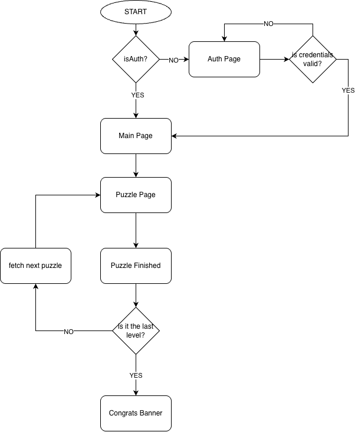
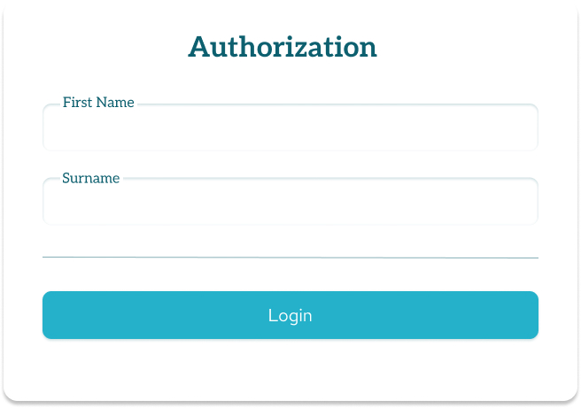
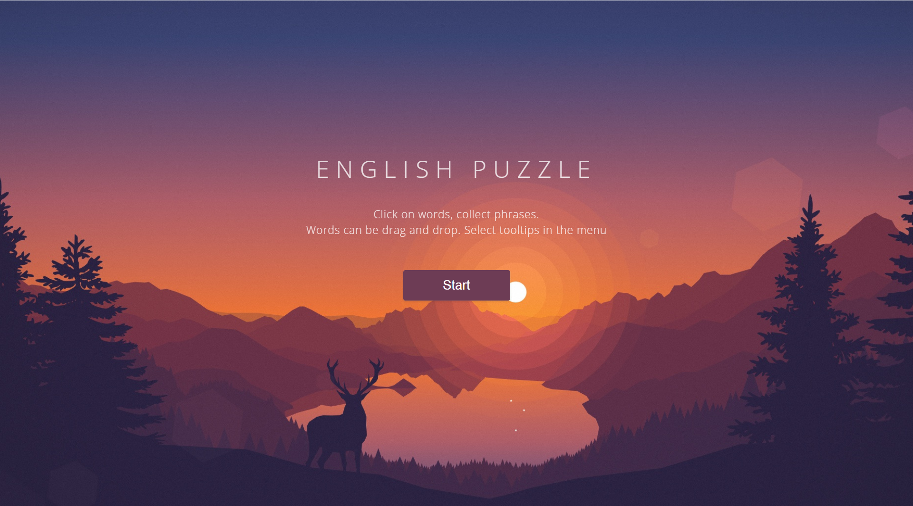
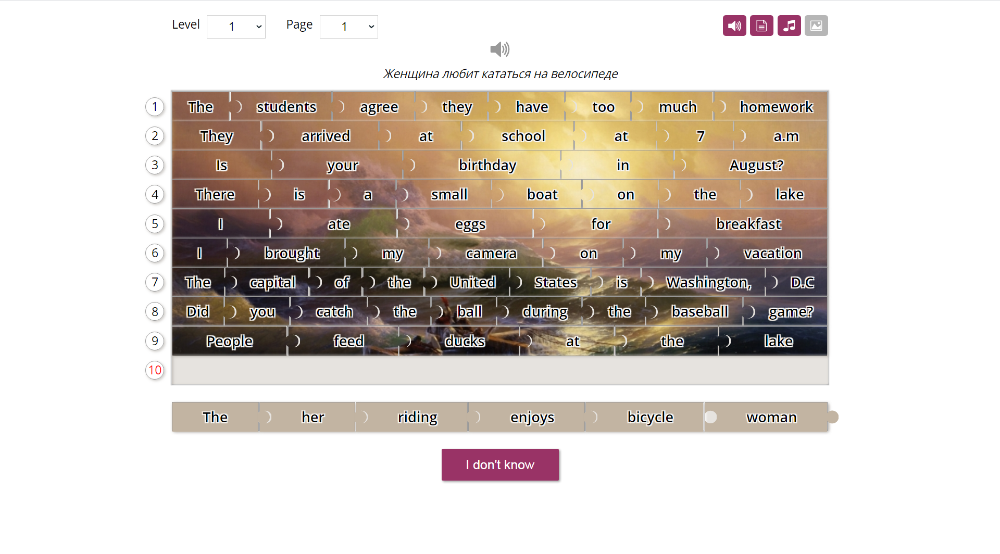
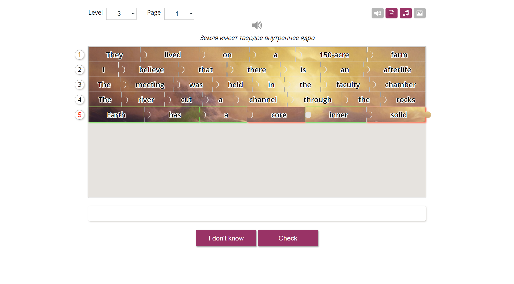
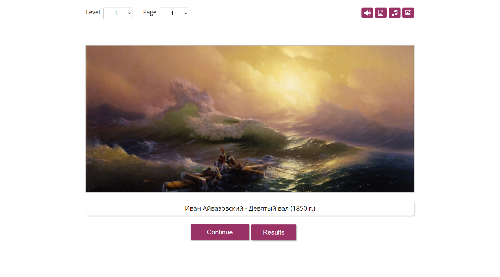
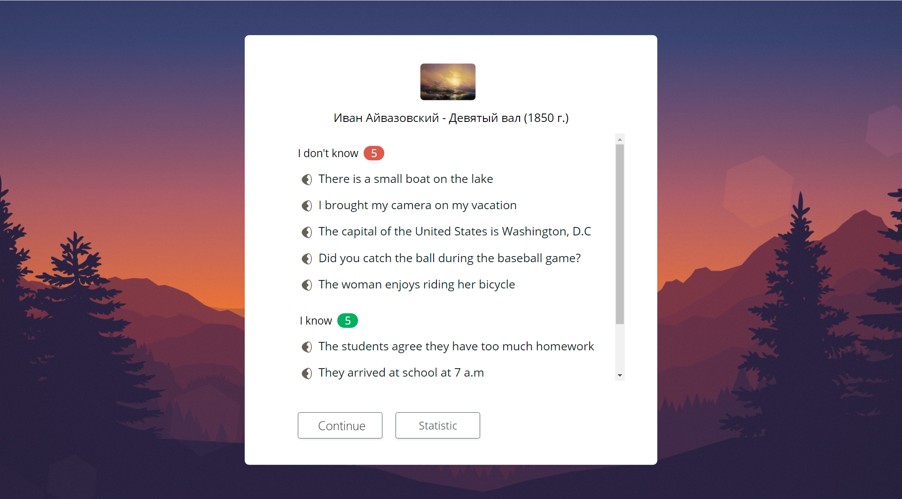

# RSS Puzzle

- [SOURCE](#source)

- [DECIDING REQUIREMENTS](#deciding-requirements)
  - [Functional Requirements](#functional-requirements)

  - [Non Functional Requirements](#non-functional-requirements)

- [API Design](#api-design)
  - [Flow diagram](#flow-diagram)

  - [API Requirements](#api-requirements)
    - [Header](#1-header-is-the-same-for-spa)

    - [Authorization](#2-authorization)

    - [Authorization](#2-authorization)

## Source

[RSS Puzzle Task](https://github.com/rolling-scopes-school/tasks/tree/master/stage2/tasks/puzzle)

## Functional Requirements

<table border="1">
    <tr>
        <th>Requirement</th>
        <th>Description</th>
    </tr>
    <tr>
        <td>Create an interactive mini-game aimed at enhancing English language skills</td>
        <td>Players assemble sentences from jumbled words. The game integrates various levels of difficulty, hint options, and a unique puzzle-like experience with artwork.</td>
    </tr>
    <tr>
        <td>Add Login / Logout</td>
        <td>Personalized access with name storage in local storage.</td>
    </tr>
    <tr>
        <td>Add hints</td>
        <td>Translation, pronunciation, and puzzle image enabling / disabling, autocomplete sentence button</td>
    </tr>
    <tr>
        <td>Add audio pronunciation functionality</td>
        <td>There should be a button to listen to sentence pronunciation.</td>
    </tr>
    <tr>
        <td>Add game levels</td>
        <td>Choose from six difficulty levels and various rounds.</td>
    </tr>
    <tr>
        <td>Add puzzle grag and drop functionality and main game process</td>
        <td>User can move words and create sentences.</td>
    </tr>
    <tr>
        <td>Add Statistics and Progress Tracking</td>
        <td>Review performance and artwork on the statistics page.</td>
    </tr>
</table>

## Non Functional Requirements

<table border="1">
    <tr>
        <th>Requirement</th>
        <th>Description</th>
    </tr>
    <tr>
        <td><strong>Availability</strong></td>
        <td>The game should be highly available</td>
    </tr>
    <tr>
        <td><strong>Low Latency</strong></td>
        <td>Hints and audio should be shown with low latency</td>
    </tr>
    <tr>
        <td><strong>Scalability</strong></td>
        <td>The game should support extesibility</td>
    </tr>
</table>

# API Design

## Flow Diagram

## API Requirements

### 1. Header is the same for SPA

### 2. Authorization

#### 1. Implementation of Input Fields and Login Button

- The user name entry page includes two separate input fields for the first name and surname.
- Both input fields are configured as mandatory for form submission.
- A 'Login' button is present and appropriately positioned on the page.
- The input fields and 'Login' button are styled for clear visibility and user interaction. [RSS-PZ-01](https://github.com/rolling-scopes-school/tasks/blob/master/stage2/tasks/puzzle/stories/RSS-PZ-01.md)

#### 2. Comprehensive Field Validation

- The first name and surname input fields only accept English alphabet letters and the hyphen.
- The first letter of each input field is validated to be uppercase.
- The first name field requires a minimum of 3 characters, and the surname field requires at least 4 characters.
- Appropriate error messages are displayed for each validation failure. [RSS-PZ-02](https://github.com/rolling-scopes-school/tasks/blob/master/stage2/tasks/puzzle/stories/RSS-PZ-02.md)

#### 3 Start Page

### 3 - Main page / Game Page

### 4 - Statistic Page

